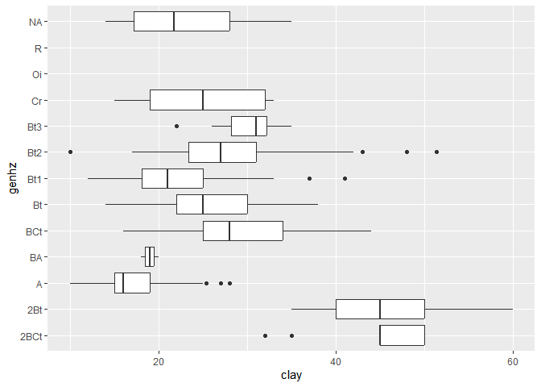

<!-- README.md is generated from README.Rmd. Please edit that file -->

# {ggspc}

<!-- badges: start -->
<!-- badges: end -->

The goal of {ggspc} is to provide custom ‘Stat’, ‘Geom’ and ‘theme’
definitions for ‘SoilProfileCollection’ object compatibility with
‘ggplot2’.

## Installation

You can install the development version of {ggspc} like so:

``` r
remotes::install_github("brownag/ggspc")
```

## Example

This is a basic example which shows you how to solve a common problem:

``` r
library(ggspc)
library(ggplot2)
#> Warning: package 'ggplot2' was built under R version 4.2.2

data(loafercreek, package = "soilDB")

ggplot(loafercreek, aes(clay, genhz)) +
  geom_boxplot(na.rm = TRUE)
#> Loading required package: aqp
#> This is aqp 2.0
```



``` r

# ggplot(loafercreek, aes(x = clay)) +
#   stat_pscs_wtd(na.rm = TRUE)
```
