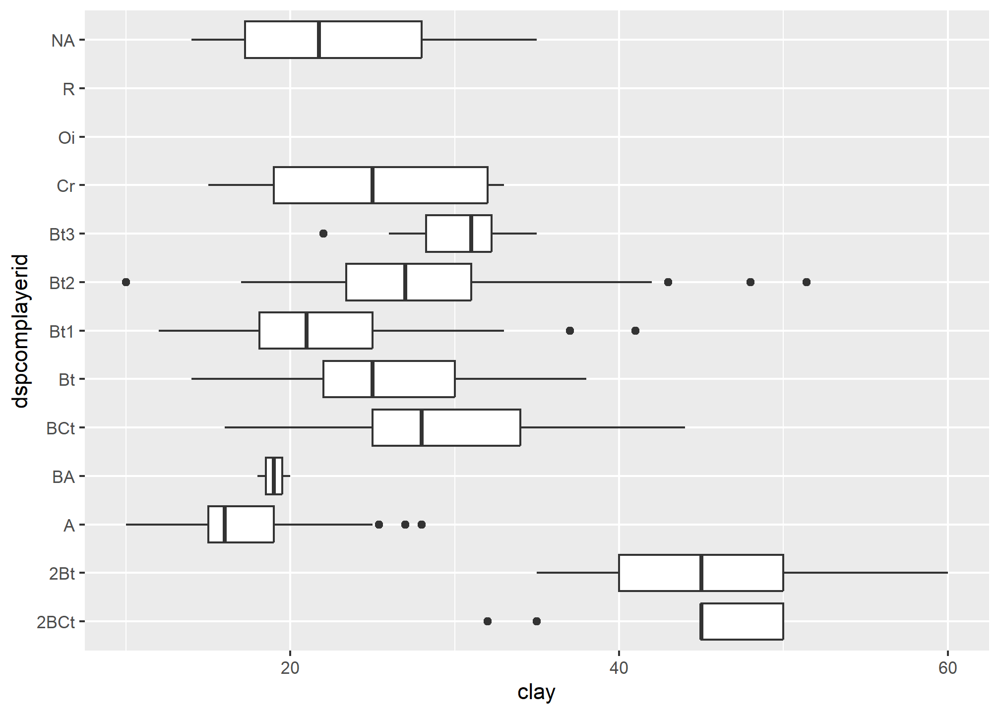
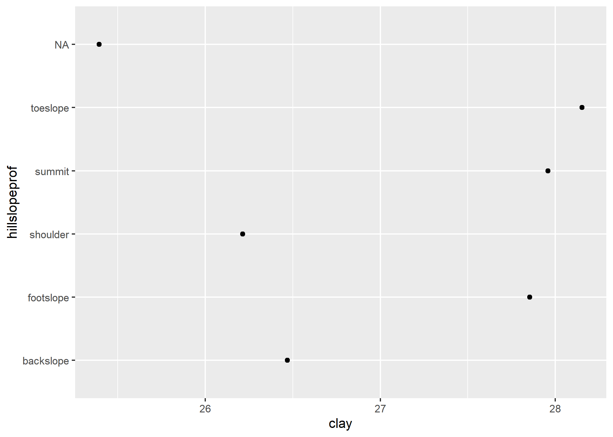

<!-- README.md is generated from README.Rmd. Please edit that file -->

# {ggspc}

<!-- badges: start -->
<!-- badges: end -->

The goal of {ggspc} is to provide custom ‘Stat’, ‘Geom’ and ‘theme’
definitions for ‘SoilProfileCollection’ object compatibility with
‘ggplot2’.

## Installation

You can install the development version of {ggspc} like so:

``` r
remotes::install_github("brownag/ggspc")
```

## Example

This a example shows how to solve the common problem of plotting
variables contained in a `SoilProfileCollection` with
`ggplot2::ggplot()`

``` r
library(aqp)
#> This is aqp 2.0
library(ggspc)
library(ggplot2)

data(loafercreek, package = "soilDB")
GHL(loafercreek) <- "genhz"
```

### Basics

This is a demonstration of what is possible with a simple
`fortify(<SPC>)` method defined. The “fortify” method makes it such that
names from horizon and site slots of the SPC can be used in `ggplot()`
aesthetics via `aes()`.

``` r
# site v.s. site level
ggplot(loafercreek, aes(earthcovkind1, slope_field)) +
  geom_boxplot(na.rm = TRUE)
```


``` r
# site v.s. horizon level
ggplot(loafercreek, aes(hillslopeprof, clay)) +
  geom_boxplot(na.rm = TRUE)
```


``` r
# horizon v.s. horizon level
ggplot(loafercreek, aes(clay, genhz)) +
  geom_boxplot(na.rm = TRUE)
```



### Depth Weighted Aggregation (`stat_depth_weighted()`)

The `stat_depth_weighted()` function is a specialized {ggplot2}
statistic intended for calculation of depth-weighted values for horizon
data in a `SoilProfileCollection`. The default uses a constant interval
`from=0` `to=200` (centimeters), but the intervals of interest may
alternately be specified as site-level column names (unquoted), and
therefore may vary between profiles.

Currently, `stat_depth_weighted()` only supports the “point” geometry
type, but in future “boxplot” and others may be supported.

``` r
# default y aesthetic is the profile_id(<SPC>)
ggplot(loafercreek[1:10], aes(clay)) +
  stat_depth_weighted(na.rm = TRUE)
```


``` r
# can use alternate y aesthetic, e.g. hillslopeprof
ggplot(loafercreek, aes(clay, hillslopeprof)) +
  stat_depth_weighted(na.rm = TRUE)
```


``` r
# continuous y axes works too (horizon v.s. horizon)
ggplot(loafercreek, aes(clay, sand)) +
  stat_depth_weighted(na.rm = TRUE)
```


``` r
# continuous y (horizon v.s. site)
ggplot(loafercreek, aes(clay, slope_field)) +
  stat_depth_weighted(na.rm = TRUE)
```


``` r
# can combine with typical ggplot geoms (0-200cm mean over boxplots)
ggplot(loafercreek, aes(clay, hillslopeprof)) +
  geom_boxplot(na.rm = TRUE) + 
  stat_depth_weighted(na.rm = TRUE, col = "red", pch = 17, cex = 3)
```


``` r
# use site-level columns for profile-specific intervals (e.g. PSCS)
ggplot() +
  stat_depth_weighted(
    loafercreek,
    aes(clay, hillslopeprof),
    na.rm = TRUE,
    from = psctopdepth,
    to = pscbotdepth
  )
```



## Problem

Currently the stat\_\* function extracts metadata after the `fortify()`
method is called by accessing a “last SoilProfileCollection” cached in a
special environment `ggspc.env` exported by the package.

This causes problems for the times when the data are defined in the
`ggplot()` call, such as the following unexpected behavior. This follows
from the hacky-ness of the aforementioned caching side
effect/dependency. This can be “fixed” with an explicit reference to the
dataset (i.e. `x + stat_depth_weighted(loafercreek)`).

Perhaps there is a better, more canonical ggplot2 way to implement this
I have still not figured out. As an alternative to overwriting a last
SPC object in a shared package environment, I return the SPC as an
attribute of the `ggplot()` result, but I don’t know that it is possible
to expose that attribute to the `stat_*` functions or `ggproto` classes
by any standard method.

``` r
data(loafercreek, package = "soilDB")
data(gopheridge, package = "soilDB")

x <- ggplot(loafercreek, aes(clay, hillslopeprof))
x <- ggplot(gopheridge, aes(clay, hillslopeprof))

x + geom_boxplot() # works
#> Warning: Removed 80 rows containing non-finite values (`stat_boxplot()`).
```


``` r
y + geom_boxplot() # works
#> Error in eval(expr, envir, enclos): object 'y' not found

x + stat_depth_weighted() # error
```


``` r
x + stat_depth_weighted(loafercreek) # works
```


``` r
y + stat_depth_weighted() # error
#> Error in eval(expr, envir, enclos): object 'y' not found
x + stat_depth_weighted(gopheridge) # works
```


